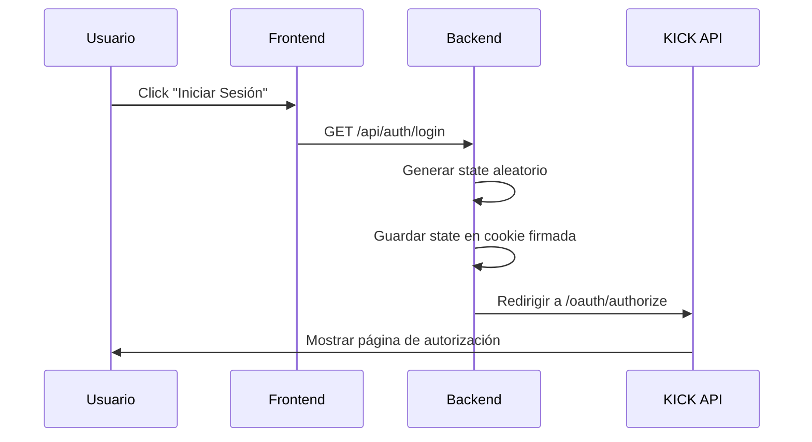
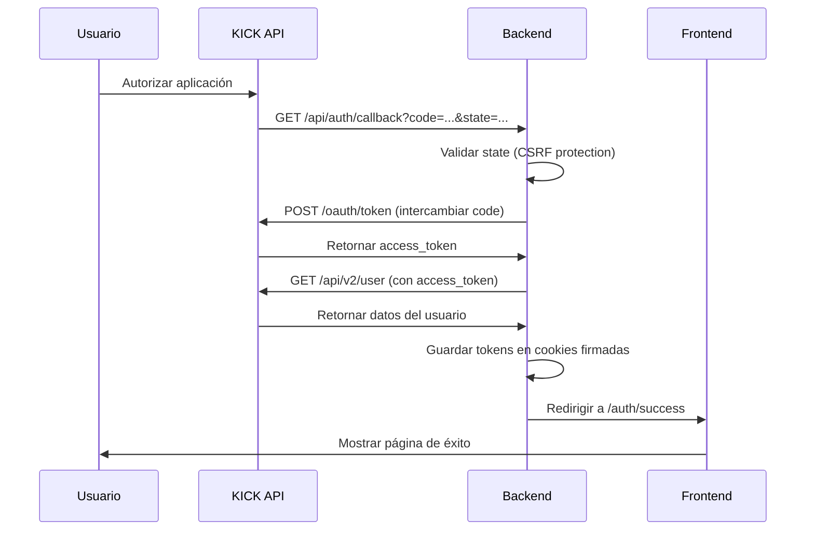
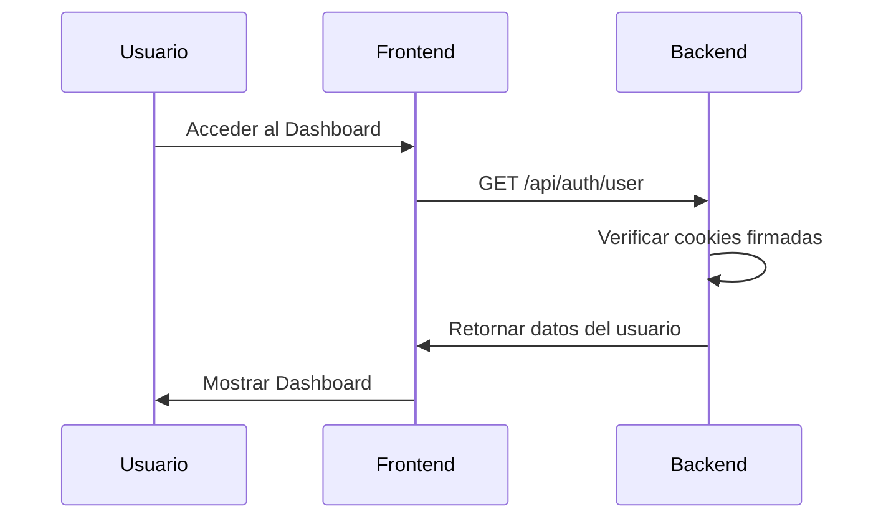

# Documentación Técnica - Integración KICK API con OAuth2

## 📋 Tabla de Contenidos

1. [Resumen del Proyecto](#resumen-del-proyecto)
2. [Arquitectura](#arquitectura)
3. [Tecnologías Utilizadas](#tecnologías-utilizadas)
4. [Configuración del Entorno](#configuración-del-entorno)
5. [Flujo de Autenticación OAuth2](#flujo-de-autenticación-oauth2)
6. [Estructura del Proyecto](#estructura-del-proyecto)
7. [API Endpoints](#api-endpoints)
8. [Seguridad](#seguridad)
9. [Guía de Despliegue](#guía-de-despliegue)

## Resumen del Proyecto

Este proyecto implementa una integración completa y segura con la API de KICK usando el protocolo OAuth2. La aplicación consta de dos partes principales:

- **Frontend**: Aplicación React construida con Vite que proporciona una interfaz de usuario moderna
- **Backend**: API REST construida con Express.js que maneja la autenticación y comunicación con KICK

## Arquitectura

```
┌─────────────────┐
│                 │
│    Frontend     │
│  (React+Vite)   │
│   Port: 5173    │
│                 │
└────────┬────────┘
         │
         │ HTTP/HTTPS
         │
┌────────▼────────┐
│                 │
│     Backend     │
│   (Express.js)  │
│   Port: 3001    │
│                 │
└────────┬────────┘
         │
         │ OAuth2
         │
┌────────▼────────┐
│                 │
│    KICK API     │
│  id.kick.com    │
│                 │
└─────────────────┘
```

## Tecnologías Utilizadas

### Frontend
- React 19.1.1
- Vite 7.1.7
- React Router DOM 7.9.4
- Axios 1.12.2
- CSS3 con gradientes y animaciones

### Backend
- Node.js (ES Modules)
- Express.js 5.1.0
- Axios 1.12.2
- cookie-parser 1.4.7
- cors 2.8.5
- helmet 8.1.0
- dotenv 17.2.3

## Configuración del Entorno

### Backend

1. Crear archivo `.env` en la carpeta `backend/`:

```env
# Server Configuration
PORT=3001
NODE_ENV=development

# KICK OAuth2 Configuration
KICK_CLIENT_ID=tu_client_id_de_kick
KICK_CLIENT_SECRET=tu_client_secret_de_kick
KICK_REDIRECT_URI=http://localhost:3001/api/auth/callback

# OAuth Scopes
KICK_SCOPES=user:read channel:read channel:write chat:write streamkey:read events:subscribe moderation:ban

# Frontend URL
FRONTEND_URL=http://localhost:5173

# Cookie Secret (generar un string aleatorio seguro)
COOKIE_SECRET=tu_secreto_aleatorio_muy_seguro_aqui

# Session Configuration
SESSION_MAX_AGE=3600000
```

### Frontend

1. Crear archivo `.env` en la carpeta `frontend/` (opcional):

```env
VITE_API_URL=http://localhost:3001
```

## Flujo de Autenticación OAuth2

### 1. Inicio de Sesión



### 2. Callback y Obtención de Token



### 3. Acceso a Recursos Protegidos



## Estructura del Proyecto

```
myPortfolio/
├── frontend/               # Aplicación React
│   ├── src/
│   │   ├── components/    # Componentes reutilizables
│   │   ├── pages/        # Páginas
│   │   │   ├── Home.jsx
│   │   │   ├── AuthSuccess.jsx
│   │   │   ├── AuthError.jsx
│   │   │   └── Dashboard.jsx
│   │   ├── services/     # Servicios de API
│   │   │   └── api.js
│   │   ├── App.jsx       # Componente principal
│   │   └── main.jsx      # Punto de entrada
│   ├── .env.example
│   ├── package.json
│   └── vite.config.js
├── backend/              # API Express
│   ├── src/
│   │   ├── config/      # Configuraciones
│   │   │   └── oauth.config.js
│   │   ├── middlewares/ # Middlewares
│   │   │   └── errorHandler.js
│   │   ├── routes/      # Rutas
│   │   │   ├── api.routes.js
│   │   │   └── auth.routes.js
│   │   ├── utils/       # Utilidades
│   │   │   └── oauthHelpers.js
│   │   ├── app.js       # Configuración Express
│   │   └── index.js     # Punto de entrada
│   ├── .env.example
│   └── package.json
└── docs/
    └── kick-api/
        └── TECHNICAL_DOCS.md
```

## API Endpoints

### Health Check

```
GET /health
```

**Respuesta:**
```json
{
  "status": "ok",
  "timestamp": "2025-01-21T10:30:00.000Z",
  "uptime": 123.456
}
```

### Información de la API

```
GET /api/info
```

**Respuesta:**
```json
{
  "name": "KICK API Integration",
  "version": "1.0.0",
  "description": "Backend API for KICK OAuth2 integration",
  "endpoints": {...},
  "oauth": {
    "provider": "KICK",
    "scopes": ["user:read", "channel:read", ...]
  }
}
```

### Iniciar Login OAuth

```
GET /api/auth/login
```

Inicia el flujo de OAuth2:
1. Genera un state aleatorio
2. Lo guarda en cookie firmada
3. Redirige a KICK para autorización

### Callback OAuth

```
GET /api/auth/callback?code=...&state=...
```

Maneja el callback de KICK:
1. Valida el state
2. Intercambia el code por access_token
3. Obtiene datos del usuario
4. Guarda tokens en cookies firmadas
5. Redirige al frontend

### Obtener Usuario

```
GET /api/auth/user
```

**Respuesta:**
```json
{
  "user": {
    "id": "123456",
    "username": "usuario_kick",
    "email": "usuario@example.com"
  },
  "authenticated": true
}
```

### Cerrar Sesión

```
POST /api/auth/logout
```

**Respuesta:**
```json
{
  "success": true,
  "message": "Logged out successfully"
}
```

## Seguridad

### Protección CSRF

- Se genera un state aleatorio usando `crypto.randomBytes(32)`
- El state se guarda en una cookie firmada
- En el callback, se valida que el state recibido coincida con el almacenado

### Cookies Firmadas

Todas las cookies sensibles están firmadas usando el `COOKIE_SECRET`:
- `oauth_state`: State para validación CSRF
- `access_token`: Token de acceso de KICK
- `refresh_token`: Token de refresco (si está disponible)
- `user_data`: Datos del usuario

### Middlewares de Seguridad

- **Helmet**: Configura headers HTTP seguros
- **CORS**: Restringe el acceso solo al frontend especificado
- **cookie-parser**: Valida firmas de cookies

### Variables de Entorno

Nunca se deben commitear las credenciales:
- Los archivos `.env` están en `.gitignore`
- Se proporcionan archivos `.env.example` como plantilla

## Scopes de KICK API

Los siguientes permisos están configurados:

| Scope | Descripción |
|-------|-------------|
| `user:read` | Leer información del usuario |
| `channel:read` | Leer información del canal |
| `channel:write` | Modificar configuración del canal |
| `chat:write` | Enviar mensajes al chat |
| `streamkey:read` | Acceder a la clave de streaming |
| `events:subscribe` | Suscribirse a eventos en tiempo real |
| `moderation:ban` | Moderar usuarios (banear/desbanear) |

## Guía de Despliegue

### Desarrollo Local

1. **Backend:**
```bash
cd backend
npm install
cp .env.example .env
# Editar .env con credenciales
npm run dev
```

2. **Frontend:**
```bash
cd frontend
npm install
npm run dev
```

### Producción

1. **Configurar variables de entorno de producción**
   - Usar HTTPS
   - Configurar `NODE_ENV=production`
   - Generar `COOKIE_SECRET` seguro
   - Actualizar URLs a dominios de producción

2. **Backend:**
```bash
cd backend
npm install --production
npm start
```

3. **Frontend:**
```bash
cd frontend
npm install
npm run build
# Servir la carpeta dist/ con un servidor web
```

### Consideraciones de Producción

- ✅ Usar HTTPS en producción
- ✅ Configurar cookies con `secure: true`
- ✅ Configurar CORS apropiadamente
- ✅ Usar variables de entorno seguras
- ✅ Implementar rate limiting
- ✅ Configurar logging apropiado
- ✅ Implementar monitoreo de errores

## Solución de Problemas

### Error: "Missing required environment variables"

Asegúrate de que el archivo `.env` existe y contiene todas las variables requeridas.

### Error: "Invalid state"

El state de OAuth2 no coincide. Esto puede ocurrir si:
- Las cookies están deshabilitadas
- Hay un problema con el `COOKIE_SECRET`
- El navegador bloqueó las cookies de terceros

### Error: "CORS"

Verifica que `FRONTEND_URL` en el backend coincida con la URL del frontend.

## Recursos Adicionales

- [Documentación OAuth2](https://oauth.net/2/)
- [KICK API Documentation](https://docs.kick.com/) (si está disponible)
- [Express.js Security Best Practices](https://expressjs.com/en/advanced/best-practice-security.html)
- [React Security Best Practices](https://react.dev/learn/security)

## Licencia

MIT

---

**Autor:** Deiby Arango  
**Fecha:** 2025  
**Versión:** 1.0.0
